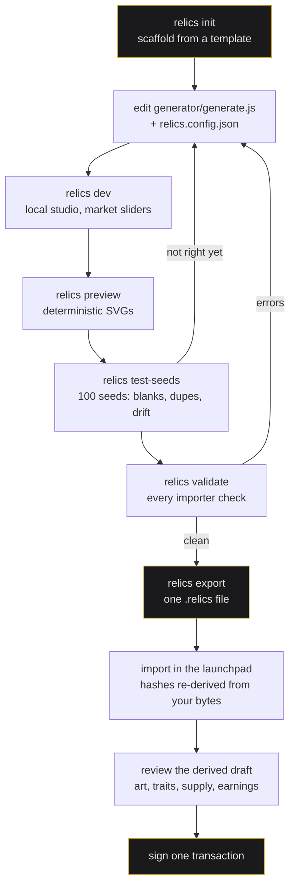

# RELICS Creator Kit

**Write generative art as one JavaScript file or a set of Solidity-SVG parameters, wire market
signals to it, render a hundred seeds until you like them, and export a single `.relics` file that
a launchpad can turn into a token, an NFT collection and a Uniswap v4 pool.**

```
YOUR IDEA  +  YOUR ART  +  YOUR RULES   →   ONE .relics FILE   →   RELICS LAUNCHPAD
```

### Start here

| | |
| --- | --- |
| 🤖 **[Create with an AI agent](docs/creator-kit/create-with-an-agent.md)** | Clone the repo, paste one prompt, describe your collection in plain language. The agent writes the generator and runs the checks. |
| 🛠 **[Build it yourself](docs/creator-kit/getting-started.md)** | Six commands, no network, no wallet. Scaffold → preview → validate → export. |
| 📖 **[See how it works](#what-a-relics-file-is)** | The bundle, the market-to-art model, and what a launch actually does. |

[](packages/creator-cli/)
[](docs/creator-kit/bundle-format.md)
[](https://github.com/MeltedMindz/relicsv4/actions/workflows/creator-kit.yml)
[](package.json)
[](LICENSE)


*Every image above came out of `relics preview`. Same seed, same picture — on your laptop, in the
importer, and in ten years.*

---

## Table of contents

- [What you actually build](#what-you-actually-build)
- [Create with an AI agent](#create-with-an-ai-agent)
- [Build it yourself](#build-it-yourself)
- [The one file you edit](#the-one-file-you-edit)
- [The whole path, end to end](#the-whole-path-end-to-end)
- [What a `.relics` file is](#what-a-relics-file-is)
- [The starter templates](#the-starter-templates)
- [Market history is the medium](#market-history-is-the-medium)
- [Launch protection, chains and fees](#launch-protection-chains-and-fees)
- [Advanced paths](#advanced-paths)
- [Status, honestly](#status-honestly)

---

## What you actually build

A RELICS project is a directory on your machine. It holds:

- **a generator** — one JavaScript file exporting `render(context)`, or a parameter file for a
  registered on-chain Solidity renderer;
- **a trait schema** — the named dimensions and weights the collection draws from;
- **market mappings** — declarative wiring from market signals to art parameters;
- **collection metadata** — name, symbol, description, cover image;
- **`relics.config.json`** — supply, earnings, chains, runtime.

`relics export` packs all of it into one `.relics` file with hashes over its own contents. That
file is what you hand the launchpad.

Nothing in this kit signs a transaction, broadcasts anything, or contacts a network. You can do
every step below on a plane.

---

## Create with an AI agent

You describe the collection. The agent writes the generator, wires the market mappings, runs the
checks, and iterates until the previews look right.

```bash
git clone https://github.com/MeltedMindz/relicsv4.git
cd relicsv4
npm install
```

Then open your agent in this directory and paste:

> Read `docs/creator-kit/create-with-an-agent.md` and `AGENTS.md`, then help me build a RELICS
> project. Scaffold it with `npm run kit -- init`, write the generator, and use
> `npm run kit -- preview` and `npm run kit -- validate` after every change until validation
> passes with no errors. Ask me about the art before you write any code.

**[→ The full prompt, and what the agent may and may not decide for you](docs/creator-kit/create-with-an-agent.md)**

---

## Build it yourself

Six commands. Everything below was run against this commit.

```bash
git clone https://github.com/MeltedMindz/relicsv4.git
cd relicsv4
npm install
```

```bash
# 1. see what you can start from
npm run kit -- templates

# 2. scaffold a project
npm run kit -- init my-project --template minimal

# 3. open the local studio on 127.0.0.1 — render any seed, drag the market sliders
npm run kit -- dev my-project

# 4. write deterministic SVGs and a contact sheet
npm run kit -- preview my-project --count 8

# 5. sweep a wide seed range for failures, blanks and duplicate traits
npm run kit -- test-seeds my-project --count 100

# 6. run every check the importer will run. Writes nothing.
npm run kit -- validate my-project

# 7. validate, then write the bundle
npm run kit -- export my-project --output my-project.relics

# read a bundle someone sent you — without executing its generator
npm run kit -- inspect my-project.relics
```

> **A fresh project fails validation on purpose.** Every template ships
> `earnings.creatorRecipient: "0x1111…1111"`, and `validate` refuses it with
> `EARNINGS_RECIPIENT_PLACEHOLDER`. Put your own address in `relics.config.json` before you export.
> That gate is the only thing standing between a scaffolded template and a clean run.

The CLI has **zero runtime dependencies** — plain ESM, no build step. `npm install` is for the demo
web app and the test tooling; `npm run kit` works in a freshly cloned repo before it finishes.

**[→ Getting started, step by step](docs/creator-kit/getting-started.md)** ·
**[→ Every command and flag](docs/creator-kit/cli.md)**

---

## The one file you edit

This is the single most common confusion, so it gets its own section.

| File | Where it lives | Who writes it |
| --- | --- | --- |
| **`relics.config.json`** | your project directory | **YOU.** Name, symbol, supply, runtime, earnings, chains. |
| `relics.project.json` | **only inside the `.relics` file** | **GENERATED at export.** Never appears in your project directory. |

`relics.project.json` is derived from your config and your files at export time. Hand-editing it
cannot change what launches — it can only make the hashes disagree, and then the importer refuses
the bundle. If you find yourself opening it, you want `relics.config.json` instead.

---

## The whole path, end to end



Every step through `relics export` works today, offline, with no wallet. The import and signing
steps depend on the launchpad's current launch state — see [Status, honestly](#status-honestly).

---

## What a `.relics` file is

One deterministic, uncompressed ZIP. Standard `unzip` reads it. It carries dual **SHA-256** and
**keccak-256** commitments over its own contents, so an importer re-derives every hash from the
bytes you uploaded and can prove it is reading exactly what you exported.

Here is a real bundle, exported from the `minimal` template — 16 entries, 18,283 bytes:

```
my-project.relics
├── generator/generate.js        2,501 B   ← YOU WROTE THIS   (the art)
├── traits/schema.json             720 B   ← YOU WROTE THIS   (dimensions + weights)
├── market/mappings.json            37 B   ← YOU WROTE THIS   (sensor → transform → destination)
├── metadata/collection.json       241 B   ← YOU WROTE THIS   (name, description, cover)
├── assets/                                ← YOU WROTE THIS   (cover image, if any)
├── README.md                    1,344 B   ← optional
├── LICENSE                        435 B   ← optional
│
├── previews/seed-1.svg            971 B   ⟵ GENERATED  written from the live render at export,
├── previews/seed-2.svg            595 B   ⟵ GENERATED  not copied from your previews/ directory
├── previews/seed-3.svg            565 B   ⟵ GENERATED
├── …seeds 5, 8, 13, 21, 34                ⟵ GENERATED
│
├── relics.project.json          3,094 B   ⟵ GENERATED  the manifest
└── checksums.json               1,808 B   ⟵ GENERATED  per-file digests + the bundle hash
```

**A bundle configures art, never contracts.** It cannot carry `.sol`, `.wasm`, executables, shell
scripts, key material or `.env` files — those extensions are refused everywhere, each with its own
message. There is no manifest field in which a bundle could supply a hook, a token, a router or a
fee. A custom hook is a separate, reviewed process.

**A render is a pure function of its inputs.** No clock, no network, no `Math.random`. Validation
renders every sampled seed twice and refuses a generator whose output moves between the two runs.

**[→ The bundle format: every field, every hash recipe](docs/creator-kit/bundle-format.md)** ·
**[→ Why every bundle is treated as hostile](docs/creator-kit/bundle-security.md)** ·
**[→ Writing an importer](docs/creator-kit/importing.md)**

---

## The starter templates

Five ship. All five scaffold, validate and export cleanly — that is checked in CI on every push
(`npm run kit:templates`). The output below is verbatim from that check.

| Template | Runtime | Market-responsive | Runtime the launchpad binds first |
| --- | --- | --- | --- |
| `solidity-svg-params` | `SOLIDITY_SVG_V1` | yes | **yes** |
| `market-responsive` | `ONCHAIN_JAVASCRIPT_V1` | yes — 4 mappings | not yet |
| `minimal` | `ONCHAIN_JAVASCRIPT_V1` | no | not yet |
| `onchain-js` | `ONCHAIN_JAVASCRIPT_V1` | no | not yet |
| `static-art` | `ONCHAIN_JAVASCRIPT_V1` | no, by design | not yet |

**That last column is about the RUNTIME, not the chain.** Creator launches are open on Robinhood
Chain (4663) and there is no RC6 factory on the other three — run `npm run kit:status` and read it
rather than trusting this table. What the column asks is which runtime a launch will bind and
render: that is `SOLIDITY_SVG`, and it is the only one, so the four JavaScript templates cannot be
launched anywhere yet. They author, preview, validate and export exactly as well; they are behind it
in the queue, not broken.

**Approved and launchable are different questions, and the kit does not collapse them.** Both
runtimes are approved: the format accepts them, they validate, they preview, they export. The
JavaScript templates are marked "preview only" everywhere they appear — in `relics templates`, in
`relics init`, in `relics validate` and in the CI table — rather than quietly presented as
launchable. They are not being deleted for a release-schedule reason.

- **`solidity-svg-params`** — configure a registered on-chain Solidity renderer by parameters, with
  a local preview of the same shapes.
- **`market-responsive`** — a lattice that fractures under drawdown, thickens with volume, and
  keeps its scars. Four sensors wired to four art parameters, and a split-earnings config.
- **`minimal`** — the smallest complete project: one generator, two trait dimensions, no market
  mappings.
- **`onchain-js`** — a compact generator written with the 36,000-byte script budget in view the
  whole time.
- **`static-art`** — seed-driven composition with no market mappings at all. The art never changes.

There is no p5-style template, because p5 is not an approved runtime and the schema refuses a
bundle that names one. Shipping a template that could not export would be a worse answer than
shipping none.

---

## Market history is the medium

The art is not a stored image. A collection reads its own market and renders from it:

```
IMMUTABLE DNA  +  MARKET HISTORY  +  CURRENT MARKET STATE  =  THE ART YOU SEE NOW
```

- **Immutable DNA** — the token's seed. Fixed at mint, forever. It decides what the piece *is*.
- **Current market state** — what the pool looks like right now.
- **Market history** — carried by transforms that remember: `accumulation` is a monotonic running
  total that never decreases, `decay` falls back toward baseline over a half-life in epochs, and
  `smoothing` is an exponential moving average over a window of samples. A scar driven by
  `accumulation` stays in the composition after the drawdown that cut it has recovered.

You wire it in `market/mappings.json`, and every id comes from a closed vocabulary. There is no
expression to parse, no callback, no address:

```json
{
  "id": "drawdown-fracture",
  "sensor": "drawdown",
  "transform": "clamp",
  "transformParams": { "min": 0, "max": 0.85 },
  "destination": "fracture"
}
```

**11 sensors** — what the market is doing:

`buying_pressure` · `selling_pressure` · `volume` · `tick` (price) · `volatility` · `drawdown` ·
`recovery` · `liquidity` · `holder_growth` · `epoch` · `market_seed`

**9 transforms** — how the signal is shaped:

`threshold` · `range` · `clamp` · `smoothing` · `tier` · `accumulation` · `decay` · `inverse` ·
`weighted_mix`

**11 destinations** — what changes in the art:

`palette` · `brightness` · `density` · `scale` · `symmetry` · `fracture` · `line_weight` ·
`distortion` · `geometry` · `scar` · `animation`

A sensor reading arrives in `[-1, 1]`; every transform clamps its output to `[0, 1]`, so a
destination can never receive an out-of-range value however strange the reading is. Your generator
reads them as `context.market.fracture`, `context.market.density`, and so on — with a fallback, so
a preview on day zero, before a single trade, still renders something honest rather than blank.

The validator refuses any id outside those three lists, any transform parameter outside its
published bounds, and warns when two mappings contest the same destination.

### Where the picture actually comes from

- **`tokenURI(id)`** is the artwork. It renders from the collection's immutable on-chain art
  binding — the runtime, the art configuration bytes and their hash — not from a file you uploaded.
  There is no IPFS pin to rot and no API to go down.
- **`contractURI()`** is the collection profile: name, description, the cover image. That one *is*
  published media, and the importer has to normalize it, publish it to an `ipfs://`, `https://` or
  `ar://` URI, and verify the bytes before writing it on chain. Relative paths and `data:` URIs are
  valid inside your bundle and invalid as contract-level media.

Keep the two separate in your head and the metadata story stops being confusing.

---

## Launch protection, chains and fees

**Fees.** Collected LP fees are split between the creator and the platform, and the platform's
share divides again into a $RELICS buy-and-entomb allocation and the retained protocol treasury.
Two things about that are easy to state wrongly. They are ratios applied to **fees actually
collected**, never to trading volume. And buy-and-entomb is **not a burn**: circulating supply
falls, `totalSupply` does not, and no burn event is emitted. The numbers themselves are declared
exactly once, in `packages/project-schema/src/economics.js`, and explained in
[06 — Fees and revenue](docs/launchpad/06-fees-and-revenue.md); this page deliberately does not
restate them, because a percentage asserted in two places is how a retired one survives a change.

**Chains.** The bundle format understands four — Ethereum (1), Base (8453), Robinhood Chain
(4663) and BNB Smart Chain (56) — and all four pass `chains.requested` validation. Ethereum, Base
and Robinhood quote in WETH; BNB quotes in WBNB, which is never to be called WETH. **RC6 is
deployed on Robinhood Chain and open to public creator launches there since 2026-08-19; it is not
deployed on Ethereum, Base or BNB, and no date is set for any of them.** This repository still
publishes no RC6 address, because the deployment package it publishes from has not been regenerated
as broadcast — read them from `robinhoodchain.blockscout.com`, where every RC6 contract is
source-verified. Requesting a chain in a bundle is a schema fact; it is not that chain being open.
Current table: [08 — Status](docs/launchpad/08-status.md#the-chains).

**Launch protection.** Two launch methods are offered — **Instant V4** and **Bonding curve**.
Fixed-price sale is withdrawn, because its sale phase had no per-buyer cap, no cooldown and no
maximum per transaction, so one address could take the whole allocation in one transaction. It is
refused in two places, and the difference matters:

- **Here, when you build.** `relics validate` and `relics export` refuse a bundle that elects
  `FIXED_PRICE_SALE_TO_V4`, by name, with the reason. You cannot export one.
- **At launch.** The deployed sale contract refuses it for every caller, including the protocol
  Safe and the pre-public canary path. That refusal is a comparison against a compile-time enum
  member — there is no setter and no flag that lifts it. It is a statement about the bytecode that
  is deployed, not a claim of immutability: that contract sits behind a proxy whose upgrade
  authority is a 2-of-3 Safe with no timelock, as
  [11 — Governance and upgradeability](docs/launchpad/11-governance-and-upgradeability.md) sets out.

The mode name itself stays in the format. Launch modes are an on-chain enum, and deleting a member
renumbers the ones after it, which would silently change what an already-written bundle means.

Separately, every launch elects launch protection once and permanently:

- **`PROTECTED_98_MINUTES`** — the buy-side LP fee starts at 99% and decays to 1% over 98 minutes.
  The sell side is 1% throughout. This is the studio default.
- **`NONE`** — a flat 1% both ways from the first block. It takes an explicit acknowledgement, and
  it is never to be described as protected.

There are no exemptions; the hook reads nothing about who is swapping. Protection makes immediate
acquisition expensive and removes the block-one speed advantage. It does **not** guarantee equal
allocation, identify anyone, or stop a buyer from simply waiting. It is
not Sybil-resistant: it limits what one address can do, and an attacker can split across addresses
for the cost of gas. Full detail:
[12 — Launch protection](docs/launchpad/12-launch-protection.md).


Checkpoints, as text: 0 min 99% · 1 min 98% · 10 min 89% · 30 min 69% · 60 min 39% · 90 min 9% ·
98 min and after, 1%. The sell side is 1% at every instant, in both modes.

**[→ The launchpad guide](docs/launchpad/)**

---

## Advanced paths

Two other things live in this repository. Neither is the creator kit, and neither is where a
first-time reader should start.

### Fork the starter template and deploy it yourself

A clean-room, MIT-licensed Solidity codebase: a fixed-supply ERC-20, a Uniswap v4 hook mined to a
valid address, an ERC-721 with fully on-chain metadata, three shipped renderers, and an immutable
position locker. No launchpad, no factory, no fee split — you deploy all of it, you own all of it,
and you are responsible for all of it.

Requires Foundry as well as Node. Educational; not production-ready.

**[→ Make it your own](docs/00-make-it-your-own.md)** ·
**[→ All 18 numbered guides](docs/)**

### Flagship reference

The exact production source of the live RELICS Uniswap v4 hook, byte-identical to its verified
source and proven offline to reproduce the deployed init code. It shares no code with the starter
template and is here to be read, not forked.

**[→ `flagship/`](flagship/)**

---

## Status, honestly

**You can build and export a real `.relics` bundle on any of the four chains. You can broadcast
one on Robinhood Chain (4663).** Scaffolding, the studio, previews, seed sweeps, validation, export
and inspection are all real and all work offline right now. RC6 is deployed on Robinhood Chain and
its factory there is `PUBLIC`; it is not deployed on Ethereum, Base or BNB Smart Chain, and no date
is set for any of them. This repository publishes no RC6 address yet — see
[08 — Status](docs/launchpad/08-status.md) for why, and read them off the chain's explorer. Note
separately that every launchable template targets `SOLIDITY_SVG`, so a JavaScript-runtime bundle
cannot be launched on any chain, open or not.

**Verify before you rely on any of this**, including on this README. This repository is educational
software provided "as is", without warranty. It is not affiliated with or endorsed by Uniswap,
OpenZeppelin, OpenSea, Foundry, any auditor, or any production collection. Nothing here is
financial, legal or investment advice. Deploying tokens, launching liquidity and distributing NFTs
carry real security, legal, tax and regulatory consequences — get your own qualified review before
doing anything real.

---

## Repository map

```
packages/project-schema/   the ONE schema, container, validator and hash implementation.
                           Zero dependencies. The CLI and the web importer run this exact code.
packages/creator-cli/      the `relics` CLI and its five starter templates
docs/creator-kit/          the kit: getting started, CLI, bundle format, security, importing
docs/launchpad/            what the transaction you eventually sign actually does
docs/00-…18-*.md           the fork-it-yourself starter template guides
src/ script/ test/         the starter template's Solidity, tooling and tests
apps/web/                  a config-driven Next.js demo app for the starter template
flagship/                  the deployed RELICS production hook + its offline CREATE2 proof
```

## Checks you can run

```bash
npm run kit:test        # schema, container, validator, sandbox, and every fixture
npm run kit:templates   # every starter template scaffolds, validates and exports
npm run kit:fixtures    # regenerate the fixtures — a diff means drift
npm run kit:status      # the bundled deployment record and launch-access state
```

All of these run in CI on every push. See
[`.github/workflows/creator-kit.yml`](.github/workflows/creator-kit.yml).

## Contributing and licence

[`CONTRIBUTING.md`](CONTRIBUTING.md) · [`CODE_OF_CONDUCT.md`](CODE_OF_CONDUCT.md) ·
[`SECURITY.md`](SECURITY.md)

MIT — see [`LICENSE`](LICENSE). Third-party dependencies keep their own licences; note that
**Uniswap v4-core is BUSL-1.1**. See [`THIRD_PARTY_NOTICES.md`](THIRD_PARTY_NOTICES.md).
