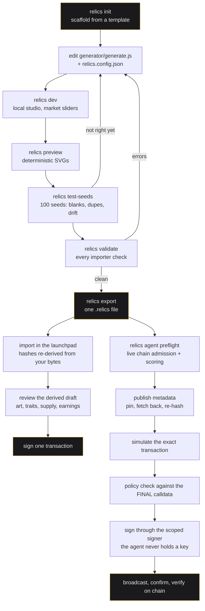

# RELICS Creator Kit

## Create and launch with an AI agent

**1. Clone.  2. Run secure setup.  3. Tell your agent what to make.  4. The agent launches it.**

```
YOUR IDEA → AI CREATES THE ART → RELICS PROVES IT → AGENT CHOOSES A LIVE CHAIN → PROTECTED SIGNER → ONCHAIN
```

Steps 1 and 2 are yours and you do them once, at a terminal. Step 3 is one paste. Step 4 is the
agent, on one command. Nothing in this repository reaches a chain until a person has finished
step 2.


*Every image above came out of `relics preview`. Same seed, same picture — on your laptop, in the
importer, and in ten years.*

---

### 1. Clone

```bash
git clone https://github.com/MeltedMindz/relicsv4.git
cd relicsv4
npm install
```

Node 20 or newer. That is the whole install.

### 2. Run secure setup — once, and only a human can

Run `npm run kit -- agent setup`. It is an interactive wizard and it is the only place any of this
is decided: the launch wallet, the address your creator earnings go to, the chains an agent may
use, the metadata pinning provider, the RPC endpoints, and the authorization itself.

**Anything secret is asked for at a real terminal prompt** — a keystore passphrase, a provider
token, a credentialled RPC URL — and never through a flag, an environment variable or an agent's
stdin. An agent cannot run this step for you and cannot read back what you typed into it.

The wizard ends by asking what you are authorizing:

| Preset | What it permits |
| --- | --- |
| `BUILD_ONLY` | Everything up to a built, simulated, policy-approved transaction. Nothing is signed and nothing is sent. |
| `SAFE_AUTONOMOUS` | **One** launch. It expires — 24 hours unless you choose otherwise — and you can revoke it at any moment. The agent decides only within the chains, quote assets and launch-protection elections you allowed. |
| `CUSTOM` | You answer each bound yourself. |

You also give it one number, in plain ETH: **the maximum network fee** you are willing to pay for
the launch transaction. It is stored as `maxTotalGasCostWei`, and it is a **total** — gas limit ×
max fee per gas — rather than two separate large ceilings whose product is a number nobody chose.

Then `npm run kit -- agent ready` prints one screen: what is configured, what the authorization
still permits, when it expires, and what is missing. Every blocker it prints names an **owner** —
whether the agent can fix it without asking, whether it needs you, whether something off this
machine is down, or whether the chain itself is saying no — so nobody spends a turn on somebody
else's work. It reads the allowed chains live; `--offline` answers from this machine alone, and an
unread chain reports `UNKNOWN` rather than `MISSING`, because those mean opposite things.

Run it before you hand anything to an agent, and again whenever you are not sure where a run
stands.

### Why the wallet is safe

Four separate properties, and each one is worth stating on its own because each fails differently.

- **The agent never sees the key.** It assembles a signing request and hands it to a signer process
  that holds the key. There is no path that returns a key to a caller: no export function, no debug
  endpoint, no "just this once". An API that can return the key is an API an agent can be talked
  into calling, and the premise here is that the agent may be reading a hostile brief.
- **The signer can only sign a validated RELICS launch.** It has three methods and no
  `signMessage`, `signTypedData` or `sendRawTransaction`. Before it signs it re-derives every fact
  from the bytes it was handed — it recomputes `keccak256(data)` rather than trusting the hash
  field, takes the selector from the first four bytes of the calldata, checks the chain and the
  factory against the approved build, and **decodes the creator's recipient out of the calldata**
  rather than accepting it alongside. Everything else can be right while that one field names
  somebody else, and it is the field carrying the project's rights and its fee stream.
- **Your earnings do not live in the launch wallet.** The launch wallet is a gas-only execution
  key. `creatorRecipient` is a separate address you choose in setup — a cold wallet, a hardware
  wallet or a Safe — and the launch wallet cannot move what is sent there.
- **The authorization is bounded, expiring and revocable.** `SAFE_AUTONOMOUS` defaults to one
  launch and expires; the grant is bound to the signer it was issued for, and it is spent by the
  launch that uses it, so a second launch needs a second grant. `npm run kit -- agent revoke` ends
  it immediately, and a revoked grant is kept rather than deleted so `agent ready` can tell you
  exactly why it is refusing.

The CLI also refuses `--private-key`, `--mnemonic` and `--seed-phrase` **by name**, everywhere,
with the reason: a key in argv is in your shell history, in `ps` output every user on the machine
can read, and in the memory of whatever started the command — which here is often an agent whose
transcript you do not control. "Unknown option" would have read as a spelling mistake and sent
somebody looking for the right flag. There isn't one; an existing key is imported inside
`agent setup`, read straight from the terminal with the echo off.

What none of that defends against: someone already running code as you. A keylogger, a debugger
attached to the signer, or swapped-out memory all defeat an encrypted keystore. That is exactly why
the launch wallet is gas-only and your earnings go somewhere else — the design assumes this key can
be lost, and that losing it costs the gas in it.

---

### 3. Tell your agent what to make

Open this repository in Claude Code, Codex, Cursor, Aider, or anything else that can read files and
run commands, and paste this. Fill in the two marked slots and nothing else.

````text
Read AGENTS.md in this repository and follow it. It is the contract for this task.

CREATE AND LAUNCH THIS:
<<<
[ paste your idea — a paragraph is plenty ]
>>>

WORKSPACE: ../my-project   (outside this repository)

Use my existing SAFE_AUTONOMOUS authorization. It is already configured and it is
my answer to the questions you would otherwise ask me.

Use a runtime a launch can bind. Make the artistic and launch decisions yourself —
chain, quote asset, launch-protection election, palette, structure, traits — inside
what I authorized. Iterate on the art until the objective gates pass: preview,
test-seeds, validate with zero errors, export.

Then run the flow through simulation, signing, broadcast, confirmation and
verification.

Do not ask me for a private key, a seed phrase, an RPC secret or a provider token.
Nothing here needs one, you are never to hold one, and I will not send one.

Do not ask me for another confirmation before broadcasting. The authorization IS
the confirmation and I gave it before you started.

Do not edit relics.agent.json or my authorization. If you think one of them is
wrong, tell me and stop — changing it invalidates it and I have to start over.

Stop only on a real blocker, and name it precisely. Do not stop at "the transaction
was sent": a hash is not a launch.

When you are done, give me: the project URL, the transaction hash, the token
address, the collection address, and the path to the launch receipt.
````

That prompt is also in
[the autonomous launch agent guide](docs/creator-kit/autonomous-launch-agent.md), beside the
detail behind every line of it.

### 4. The agent launches it

One entry point: `npm run kit -- agent run --workspace ../my-project --json`. It runs the phases in
order — preflight, metadata, prepare, predict, simulate, build, policy-check, broadcast, confirm,
verify — stops at the first refusal, and prints a machine-readable envelope on stdout at every
step. A coding agent branches on that envelope and on the exit code; it never parses prose.

The run ends at `VERIFIED` on chain, or at a named blocker. It does not end at a transaction hash.

---

## The command surface

| Command | Who runs it | What it does |
| --- | --- | --- |
| `npm run kit -- agent setup` | you, once, at a terminal | The interactive wizard: wallet, creator recipient, chains, metadata provider, RPC, authorization. TTY-only for anything secret. |
| `npm run kit -- agent ready` | you or your agent | One status screen: configuration, what the authorization permits, what is missing. Add `--json` for an agent. |
| `npm run kit -- agent run --workspace <dir> --json` | your agent | Every launch phase in order, stopping at the first refusal. |
| `npm run kit -- agent revoke` | you, whenever you want | Ends the authorization. Every launch under it is refused from that moment. |
| `npm run kit -- wallet create` · `unlock` · `lock` · `status` · `backup` · `list` | you | The launch wallet. The key is generated, encrypted and stored outside this repository; `backup` copies the already-encrypted keystore, and there is no command that prints a key. It is **not** under `agent`, deliberately: that namespace is the list an agent is told to work from, and a step it cannot perform does not belong on it. |

The offline authoring commands — `init`, `templates`, `dev`, `preview`, `test-seeds`, `validate`,
`export`, `inspect`, `doctor`, `status`, `migrate` — are in
[Build it yourself](#build-it-yourself). The rest of the chain-facing surface, phase by phase, is in
[the autonomous launch agent guide](docs/creator-kit/autonomous-launch-agent.md).

## If you never want to touch a chain

You do not have to. The authoring half of this kit is offline, needs no wallet, holds no key, and
ends at one `.relics` file you can import at <https://www.relics.wtf/create> yourself, whenever you
choose. Scaffolding, the studio, previews, seed sweeps, validation, export and inspection contact
no network at all — you can do all of it on a plane.

**[→ Getting started, offline](docs/creator-kit/getting-started.md)** ·
**[→ Create with an agent, in plain language](docs/creator-kit/create-with-an-agent.md)**

[](packages/creator-cli/)
[](docs/creator-kit/bundle-format.md)
[](docs/launchpad/08-status.md)
[](https://github.com/MeltedMindz/relicsv4/actions/workflows/creator-kit.yml)
[](package.json)
[](LICENSE)

---

## Table of contents

- [Create and launch with an AI agent](#create-and-launch-with-an-ai-agent)
- [Why the wallet is safe](#why-the-wallet-is-safe)
- [The command surface](#the-command-surface)
- [What you actually build](#what-you-actually-build)
- [Build it yourself](#build-it-yourself)
- [The one file you edit](#the-one-file-you-edit)
- [The whole path, end to end](#the-whole-path-end-to-end)
- [What a `.relics` file is](#what-a-relics-file-is)
- [Take it to the launchpad](#take-it-to-the-launchpad)
- [The starter templates](#the-starter-templates)
- [The Wave-1 art templates](#the-wave-1-art-templates)
- [Market history is the medium](#market-history-is-the-medium)
- [Launch protection, chains and fees](#launch-protection-chains-and-fees)
- [Advanced paths](#advanced-paths)
- [Honest limits](#honest-limits)
- [Status, honestly](#status-honestly)

---

## What you actually build

A RELICS project is a directory on your machine. It holds:

- **a generator** — one JavaScript file exporting `render(context)`, or a parameter file for a
  registered on-chain Solidity renderer;
- **a trait schema** — the named dimensions and weights the collection draws from;
- **market mappings** — declarative wiring from market signals to art parameters;
- **collection metadata** — name, symbol, description, cover image;
- **`relics.config.json`** — supply, earnings, chains, runtime.

`relics export` packs all of it into one `.relics` file with hashes over its own contents. That
file is what you hand the launchpad — by hand, or through the launch agent.

**Everything up to and including that file is offline.** Scaffolding, the studio, previews, seed
sweeps, validation, export and inspection contact no network, need no wallet and hold no key. The
only part of this repository that reaches a chain is the launch agent, it is off until a human has
run `agent setup`, and it is documented in
[The autonomous launch agent](docs/creator-kit/autonomous-launch-agent.md).

---

## Build it yourself

Seven commands. Everything below was run against this commit.

```bash
git clone https://github.com/MeltedMindz/relicsv4.git
cd relicsv4
npm install
```

```bash
# 1. see what you can start from
npm run kit -- templates

# 2. scaffold a project
npm run kit -- init my-project --template minimal

# 3. open the local studio on 127.0.0.1 — render any seed, drag the market sliders
npm run kit -- dev my-project

# 4. write deterministic SVGs and a contact sheet
npm run kit -- preview my-project --count 8

# 5. sweep a wide seed range for failures, blanks and duplicate traits
npm run kit -- test-seeds my-project --count 100

# 6. run every check the importer will run. Writes nothing.
npm run kit -- validate my-project

# 7. validate, then write the bundle
npm run kit -- export my-project --output my-project.relics

# read a bundle someone sent you — without executing its generator
npm run kit -- inspect my-project.relics
```

Four more exist and none of them is part of the loop: `doctor` checks that this machine can run
the kit and contacts nothing; `status` prints the deployment record and which chains take a
creator launch; `migrate` reopens a bundle from an older schema as a project you can finish; and
`help <command>` prints every flag. `npm run kit -- --help` lists all eleven.

Those eleven are the whole offline surface, and none of them reaches a network. The chain-facing
commands live in their own group, `npm run kit -- agent …`, are loaded only when one is called, and
refuse to do anything until a human has run the setup wizard and granted an authorization — see
[Create and launch with an AI agent](#create-and-launch-with-an-ai-agent).

> **A fresh project fails validation on purpose, and there are TWO refusals, not one.** Both are
> decisions the kit will not make on your behalf, because both are written on chain and permanent:
>
> - `EARNINGS_RECIPIENT_PLACEHOLDER` — every template ships
>   `earnings.creatorRecipient: "0x1111…1111"`. A launch with a placeholder here pays nobody.
> - `MARKET_ANTI_SNIPE_UNSPECIFIED` — every template ships `market.antiSnipeMode: "UNSPECIFIED"`,
>   which is a draft value. A final bundle must elect `NONE` or `PROTECTED_98_MINUTES` by name.
>   Neither is a default and neither is required of you; see
>   [Launch protection, chains and fees](#launch-protection-chains-and-fees).
>
> Fix both in `relics.config.json` and `validate` goes green. Nothing else stands between a
> scaffolded template and a clean run.

The CLI has **zero runtime dependencies** — plain ESM, no build step. `npm install` is for the demo
web app and the test tooling; `npm run kit` works in a freshly cloned repo before it finishes.

**[→ Getting started, step by step](docs/creator-kit/getting-started.md)** ·
**[→ Every command and flag](docs/creator-kit/cli.md)**

---

## The one file you edit

This is the single most common confusion, so it gets its own section.

| File | Where it lives | Who writes it |
| --- | --- | --- |
| **`relics.config.json`** | your project directory | **YOU.** Name, symbol, supply, runtime, earnings, chains. |
| `relics.project.json` | **only inside the `.relics` file** | **GENERATED at export.** Never appears in your project directory. |

`relics.project.json` is derived from your config and your files at export time. Hand-editing it
cannot change what launches — it can only make the hashes disagree, and then the importer refuses
the bundle. If you find yourself opening it, you want `relics.config.json` instead.

---

## The whole path, end to end

**The text diagram is the canonical one.** It renders everywhere a reader might open this file —
GitHub, a plain terminal, a diff, an agent's context window — and nothing has to load for it to be
read. The Mermaid version below carries the same graph for anyone who wants it in a renderer.

```
                    ┌──────────────────────────────────────────────┐
                    │  relics init      scaffold from a template   │
                    └───────────────────────┬──────────────────────┘
                                            v
        ┌───────────────────>  edit generator/generate.js + relics.config.json
        │                                   │
        │                                   v
        │                       relics dev        local studio, market sliders
        │                                   │
        │                                   v
        │                       relics preview    deterministic SVGs
        │                                   │
        │                                   v
        ├── not right yet ────── relics test-seeds   100 seeds: blanks, dupes, drift
        │                                   │
        │                                   v
        └── errors ───────────── relics validate     every importer check
                                            │ clean
                                            v
                    ┌──────────────────────────────────────────────┐
                    │  relics export       ONE .relics FILE        │
                    └───────┬──────────────────────────────┬───────┘
                            │                              │
              YOU, IN A BROWSER                  THE LAUNCH AGENT
                            │                              │
                            v                              v
        import in the launchpad                agent preflight
        hashes re-derived from your bytes      live chain admission + scoring
                            │                              │
                            v                              v
        review the derived draft               publish metadata
        art, traits, supply, earnings          pin, fetch BACK, re-hash
                            │                              │
                            v                              v
        ┌───────────────────────────┐          simulate the exact transaction
        │  you sign one transaction │                      │
        └───────────────────────────┘                      v
                                               policy check against the FINAL calldata
                                                           │
                                                           v
                                               sign through the scoped signer
                                               the agent never holds a key
                                                           │
                                                           v
                                    ┌──────────────────────────────────────────┐
                                    │  broadcast, confirm, VERIFY on chain     │
                                    └──────────────────────────────────────────┘
```

<details>
<summary>The same graph as Mermaid</summary>



</details>

Two ways out of the same file. The left branch is you, in a browser, whenever you choose. The right
branch is the launch agent, and it exists only after a human has run
[`agent setup`](#2-run-secure-setup--once-and-only-a-human-can) and granted an authorization.

Every step through `relics export` works today, offline, with no wallet. Both branches after it
depend on the launchpad's current launch state — see [Status, honestly](#status-honestly).

---

## What a `.relics` file is

One deterministic, uncompressed ZIP. Standard `unzip` reads it. It carries dual **SHA-256** and
**keccak-256** commitments over its own contents, so an importer re-derives every hash from the
bytes you uploaded and can prove it is reading exactly what you exported.

Here is a real bundle, exported from the `minimal` template with `antiSnipeMode: "NONE"` —
16 entries, 19,608 bytes. `npm run kit:readme` reproduces exactly this from the commands above,
which is why the number is safe to print:

```
my-project.relics
├── generator/generate.js        2,501 B   ← YOU WROTE THIS   (the art)
├── traits/schema.json             720 B   ← YOU WROTE THIS   (dimensions + weights)
├── market/mappings.json            37 B   ← YOU WROTE THIS   (sensor → transform → destination)
├── metadata/collection.json       241 B   ← YOU WROTE THIS   (name, description, cover)
├── assets/                                ← YOU WROTE THIS   (cover image, if any)
├── README.md                    2,643 B   ← optional
├── LICENSE                        435 B   ← optional
│
├── previews/seed-1.svg            971 B   ⟵ GENERATED  written from the live render at export,
├── previews/seed-2.svg            595 B   ⟵ GENERATED  not copied from your previews/ directory
├── previews/seed-3.svg            565 B   ⟵ GENERATED
├── …seeds 5, 8, 13, 21, 34                ⟵ GENERATED
│
├── relics.project.json          3,120 B   ⟵ GENERATED  the manifest
└── checksums.json               1,808 B   ⟵ GENERATED  per-file digests + the bundle hash
```

**A bundle configures art, never contracts.** It cannot carry `.sol`, `.wasm`, executables, shell
scripts, key material or `.env` files — those extensions are refused everywhere, each with its own
message. There is no manifest field in which a bundle could supply a hook, a token, a router or a
fee. A custom hook is a separate, reviewed process.

**A render is a pure function of its inputs.** No clock, no network, no `Math.random`. Validation
renders every sampled seed twice and refuses a generator whose output moves between the two runs.

**[→ The bundle format: every field, every hash recipe](docs/creator-kit/bundle-format.md)** ·
**[→ Why every bundle is treated as hostile](docs/creator-kit/bundle-security.md)** ·
**[→ Writing an importer](docs/creator-kit/importing.md)**

---

## Take it to the launchpad

The file is the handover. Open **<https://www.relics.wtf/create>**, choose **Import a .relics
project**, and give it the file `relics export` wrote.

What happens then, in order:

1. **The bundle is inspected and re-hashed** from the bytes you uploaded. It is never executed in
   the page. The bundle hash it shows you must equal the one `relics export` printed — if it does
   not, the file changed after export and you should re-run the export rather than proceed.
2. **It becomes a draft in the studio**, projected from your own manifest: your generator, your
   traits, your market mappings, your supply and earnings. Drafts live in that browser only.
3. **You pick the chain and the quote asset**, and every figure that depends on that choice is
   recomputed in front of you. `relics status` prints which chains take a creator launch; the
   studio re-reads the factory rather than trusting either that table or this page.
4. **The collection media is pinned and read back** by the content address the pin provider
   returned, re-hashed, and re-parsed before it is committed. A receipt is not evidence that
   anybody can read the bytes.
5. **You sign one transaction.** Token, collection, art runtime binding, birth metadata and the
   Uniswap v4 pool are created together. There is no second transaction to bind metadata
   afterwards and no pending state to come back to.

Everything before step 5 is free, reversible and off chain.

**This is not the only route, and it is the one where you hold the wallet.** The launch agent
performs the same five steps from a terminal, against the same contracts, and the difference is
where the key sits: here it is in your browser wallet and you approve the transaction yourself;
there it is in a signer process the agent talks to but never holds, and your approval was the
authorization you granted in `agent setup` before the run started. Neither route can begin without
something you explicitly did — connecting a wallet, or finishing that wizard.

---

## The starter templates

Five ship. All five scaffold, validate and export cleanly — that is checked in CI on every push
(`npm run kit:templates`). The output below is verbatim from that check.

| Template | Runtime | Market-responsive | Runtime a launch can bind |
| --- | --- | --- | --- |
| `solidity-svg-params` | `SOLIDITY_SVG_V1` | yes | **yes** |
| `market-responsive` | `ONCHAIN_JAVASCRIPT_V1` | yes — 4 mappings | no |
| `minimal` | `ONCHAIN_JAVASCRIPT_V1` | no | no |
| `onchain-js` | `ONCHAIN_JAVASCRIPT_V1` | no | no |
| `static-art` | `ONCHAIN_JAVASCRIPT_V1` | no, by design | no |

**That last column is about the RUNTIME, not the chain, and the two are independent.** The chain
half is a separate question with its own answer — run `npm run kit:status` and read it rather than
trusting any table, including this one. The runtime half is what the column asks: which runtime a
launch can bind and render. That is `SOLIDITY_SVG_V1`, and it is the only one, so the four
JavaScript templates cannot be launched — on an open chain or any other.

**The JavaScript refusal is structural, not a queue position.** `ArtRuntimeRegistryV1.modeAvailable`
is a `pure` function that admits the Solidity-SVG mode alone, so registering a JavaScript runtime
reverts `RuntimeModeNotAvailable` and no operator, no signer and no governance action can register
one. This README does not know when that changes, so it does not say — and you should treat any
sentence anywhere that implies a date as something nobody read off a chain.

**None of that costs you your work, and the kit will never trade it away for you.** A JavaScript
project authors, previews, sweeps, validates, exports and inspects exactly like a Solidity-SVG one,
and the bundle you export stays valid — nothing about it has to change if the runtime is ever
bound. The kit does not convert a JavaScript project to Solidity SVG, does not suggest switching
runtime to unlock a launch, and does not delete a generator. Those are two different artworks, and
which one you meant is not a question a validator gets to answer.

**The launch agent does not route around this either, and it is refused by evidence rather than by
a rule it could be argued out of.** Your authorization names the runtimes a run may use, and a
chain is admitted only after its own registry is read live and shows that runtime registered and
active. A JavaScript project never reaches a preflight that passes at all. An agent that offers to
switch your runtime so a launch can proceed is doing the one thing this repository tells it not to.

**Approved and launchable are different questions, and the kit does not collapse them.** Both
runtimes are approved: the format accepts them, they validate, they preview, they export. The
JavaScript templates are marked "preview only" everywhere they appear — in `relics templates`, in
`relics init`, in `relics validate` and in the CI table — rather than quietly presented as
launchable.

- **`solidity-svg-params`** — configure a registered on-chain Solidity renderer by parameters, with
  a local preview of the same shapes.
- **`market-responsive`** — a lattice that fractures under drawdown, thickens with volume, and
  keeps its scars. Four sensors wired to four art parameters, and a split-earnings config.
- **`minimal`** — the smallest complete project: one generator, two trait dimensions, no market
  mappings.
- **`onchain-js`** — a compact generator written with the 36,000-byte script budget in view the
  whole time.
- **`static-art`** — seed-driven composition with no market mappings at all. The art never changes.

There is no p5-style template, because p5 is not an approved runtime and the schema refuses a
bundle that names one. Shipping a template that could not export would be a worse answer than
shipping none.

---

## The Wave-1 art templates

A second, separate list. The starter templates above are project directories `relics init` copies.
These are **configuration presets for on-chain art runtimes** — a set of parameters an art runtime
reads to draw a token — and there is no scaffold to copy, so they are not `init` targets.

Thirty-five presets were built across eight runtimes and put through a **blind visual review**: the
reviewer read contact sheets as images, never opened a source file, and judged two axes separately —
do twelve tokens read as twelve different works at thumbnail size, and does the work visibly change
between a quiet market, a wounded one and a healed one. Seven passed the first review. Five of those
seven were then repaired and sent back through a **second blind review**, by a reviewer who had seen
neither the first verdicts nor the source — and four of the five came back lower. A sixth, `idol`,
was repaired later the same day and went through a **third** blind review, which held it. **Two
ship.** `relics templates` shows those two and nothing else.

| Template | Runtime | Config schema | Market-responsive | What it is |
|---|---|---|---|---|
| `GEOMETRIC_RECURSION_V1/compass` | GEOMETRIC_RECURSION_V1 | v2 | yes | rings of rings, coloured by level |
| `VECTOR_COMPOSITION_V1/alluvium` | VECTOR_COMPOSITION_V1 | v1 | yes | sediment: the market writes the strata |

**Wave 1 is two runtimes, and it was four.** `CELLULAR_SYSTEM_V1` and `PIXEL_GRID_V1` both left on
2026-08-29, by the same rule and not by a judgement: a runtime enters a wave only with at least one
blind-reviewed SHIP template. Cellular's last candidate was rejected on seed diversity; Pixel's only
SHIP template, `idol`, was held on the blind review of its repaired frame. Both engines render, both
validate, and both still carry reviewed templates in the ledger with their verdicts. Nothing about
either is deleted; they are simply not offered.

`idol` is worth naming because it is stuck rather than unlucky. Before the repair it failed a
structural check — a layer that drew nothing at any market state. After the repair it failed blind
review for the opposite kind of reason: the frame it draws is topologically identical on every seed,
so twelve tokens that read as twelve different works in a quiet market collapse toward one picture
in a healed one. Both honest paths end at the same verdict, which makes it a template-curation
problem for a later wave rather than a defect in the runtime.

**The config schema version is not the runtime version, and the two disagree here.** Every one of
these runtimes is at runtime version 1, while GEOMETRIC_RECURSION is at *config* version 2 — a byte
changed meaning underneath it. A config written at the version the runtime reports is rejected by
the parser, so read it from the table, not from the runtime.

### Whether you can launch one is a live read, and it is still a live read

Both Wave-1 runtimes were registered on 2026-08-29 and are **active on Ethereum, Base and Robinhood
Chain** — `GEOMETRIC_RECURSION_V1` at registry id 3, `VECTOR_COMPOSITION_V1` at id 4, the same
address on each chain. So the answer today is yes, on those three chains.

**That is a reading, not a fact this kit stores, and it is why the sentence above names a date.**
Registration is per runtime, per chain. Nothing in this repository was edited to make those runtimes
selectable and there is no flag here to flip — a fresh read of `ArtRuntimeRegistryV1` is what changed
its mind. Ask it yourself rather than trusting this paragraph:

```bash
npm run kit -- agent select-template --workspace <dir> --chain 1 --json
```

That command reads the registry and reports one of `ACTIVE`, `INACTIVE`, `NOT_REGISTERED` or
`UNKNOWN` per runtime. **`UNKNOWN` is not a soft no** — a registry that could not be read does not
prove a runtime is absent, it proves nobody successfully asked, and only one of those is a reason to
retry.

**Neither runtime that left Wave 1 is registered on any chain**, so `CELLULAR_SYSTEM_V1` and
`PIXEL_GRID_V1` are not launchable anywhere. Registry ids 5 and 6 were deliberately left empty for
them, so the survivors did not have to be renumbered if they ever return.

The JavaScript runtime is a separate question with a separate answer, and that answer is still no
for a structural reason rather than a scheduling one — see *Approved is not launchable* above.

### Effective market signals are the measured ones

Every one of these runtimes accepts all nine market sensors. **Acceptance is not effectiveness.**
Three runtimes independently shipped a field wired to a sensor that reads the same value in every
market state — legal, wired, and visually inert — so each descriptor publishes which of its bindings
actually move, measured against a committed census rather than taken from the schema.

The consequence is visible in the catalog. Both templates that ship publish an empty `ineffective`
list — every sensor they bind actually moves — and that is a measured result rather than a claim,
because the same classifier that produced it refuses other bindings by name. `EPOCH` under `LINEAR`
moves at most 125 per mille across the review fixtures, so a template binding it would be published
as **bound but measured dead**; `idol` was that template until it was held. And the curve decides as
much as the sensor: `RECOVERY` under `LOG2` separates a quiet market from a wounded one while the
same sensor under `LINEAR` does not, because `LOG2` lifts its quiet-market reading from 10 to 562 —
a fact about the curve that no amount of reading the sensor's name would give you.

### The tiers below SHIP are kept, and hidden

Five presets were reviewed "ship with caveat" and nine were held. They are not deleted, and they
are not shown by default:

```bash
npm run kit -- templates --experimental
```

That lists them with their **measured** weakness — each one's weakest state pairing out of the
perceptual census, against the census floor — rather than a paragraph of review prose. Neither tier
is offered as a starting point, and the tier the review rejected is not listed at all: a flag that
reveals everything reveals nothing.

**A held or caveated template is never promoted by someone looking at it again.** Promotion takes
four things — a contained fix, a config still inside the runtime's final bounds, a regenerated
contact sheet, and a **new blind review** returning SHIP — and the status model refuses a promotion
missing any one of them, refuses a re-labelled copy of the old review by document digest, and
refuses any method that is not blind.

**The rule runs in the other direction too, and it has been used twice.** A DOWNGRADE owes none of
those four artifacts: the artifacts exist so a template cannot be talked up without a new blind
verdict, and being talked down by one is the mechanism working. On 2026-08-29 the second blind review
moved four of the five repaired presets down, and a third review held a fifth — taking a whole
runtime out of the wave with it. The catalog followed both times with no argument. A status is not a
field anyone edits — it is read out of an append-only ledger, latest record first.

### An autonomous agent may only ever choose from the two

The selection pipeline is `brief -> live runtime availability -> SHIP catalog -> capability filter ->
semantic match -> select`, and the order is the mechanism rather than a description of it. The
presets that did not clear review are not bad at describing themselves — their weaknesses are
exactly the kind prose cannot carry, like "recovery duplicates stress" or "every token is a centred
disc" — so a matcher scoring words against words would rank several of them first. The pool is
therefore built before any matching happens, and the matcher refuses a template it is handed
directly. `--experimental` is a human affordance and reaches no agent path.

**The preset is a starting point, not a cage.** Once one is chosen, change anything the runtime's
validator accepts — palette, geometry, counts, sensors, curves, traits. Nothing in this kit compares
your finished configuration against the preset it began as, and nothing should.

---

## Market history is the medium

The art is not a stored image. A collection reads its own market and renders from it:

```
IMMUTABLE DNA  +  MARKET HISTORY  +  CURRENT MARKET STATE  =  THE ART YOU SEE NOW
```

- **Immutable DNA** — the token's seed. Fixed at mint, forever. It decides what the piece *is*.
- **Current market state** — what the pool looks like right now.
- **Market history** — carried by transforms that remember: `accumulation` is a monotonic running
  total that never decreases, `decay` falls back toward baseline over a half-life in epochs, and
  `smoothing` is an exponential moving average over a window of samples. A scar driven by
  `accumulation` stays in the composition after the drawdown that cut it has recovered.

You wire it in `market/mappings.json`, and every id comes from a closed vocabulary. There is no
expression to parse, no callback, no address:

```json
{
  "id": "drawdown-fracture",
  "sensor": "drawdown",
  "transform": "clamp",
  "transformParams": { "min": 0, "max": 0.85 },
  "destination": "fracture"
}
```

**11 sensors** — what the market is doing:

`buying_pressure` · `selling_pressure` · `volume` · `tick` (price) · `volatility` · `drawdown` ·
`recovery` · `liquidity` · `holder_growth` · `epoch` · `market_seed`

**9 transforms** — how the signal is shaped:

`threshold` · `range` · `clamp` · `smoothing` · `tier` · `accumulation` · `decay` · `inverse` ·
`weighted_mix`

**11 destinations** — what changes in the art:

`palette` · `brightness` · `density` · `scale` · `symmetry` · `fracture` · `line_weight` ·
`distortion` · `geometry` · `scar` · `animation`

A sensor reading arrives in `[-1, 1]`; every transform clamps its output to `[0, 1]`, so a
destination can never receive an out-of-range value however strange the reading is. Your generator
reads them as `context.market.fracture`, `context.market.density`, and so on — with a fallback, so
a preview on day zero, before a single trade, still renders something honest rather than blank.

The validator refuses any id outside those three lists, any transform parameter outside its
published bounds, and warns when two mappings contest the same destination.

### Where the picture actually comes from

- **`tokenURI(id)`** is the artwork. It renders from the collection's immutable on-chain art
  binding — the runtime, the art configuration bytes and their hash — not from a file you uploaded.
  There is no IPFS pin to rot and no API to go down.
- **`contractURI()`** is the collection profile: name, description, the cover image. That one *is*
  published media, so the importer normalizes it, pins the exact bytes, reads them back by the
  content address the pin provider returned, re-hashes them, and only then commits. The committed
  URI is a **content address** — an immutable `ipfs://`. A plain `https://` URL is not accepted as
  canonical media: a website can change or vanish and a launched collection's image must not, so an
  external URL is fetched server-side and an immutable copy is pinned instead. Relative paths and
  `data:` URIs are valid inside your bundle and invalid as contract-level media.

Keep the two separate in your head and the metadata story stops being confusing. The full
sequence — two digests, what each one commits to, and why a pin receipt is not evidence — is in
**[13 — Metadata and contractURI](docs/launchpad/13-metadata-and-contracturi.md)**.

---

## Launch protection, chains and fees

**Fees.** Collected LP fees are split between the creator and the platform, and the platform's
share divides again into a $RELICS buy-and-entomb allocation and the retained protocol treasury.
Two things about that are easy to state wrongly. They are ratios applied to **fees actually
collected**, never to trading volume. And buy-and-entomb is **not a burn**: circulating supply
falls, `totalSupply` does not, and no burn event is emitted. The numbers themselves are declared
exactly once, in `packages/project-schema/src/economics.js`, and explained in
[06 — Fees and revenue](docs/launchpad/06-fees-and-revenue.md); this page deliberately does not
restate them, because a percentage asserted in two places is how a retired one survives a change.

**Chains.** The bundle format understands four — Ethereum (1), Base (8453), Robinhood Chain
(4663) and BNB Smart Chain (56) — and all four pass `chains.requested` validation. Ethereum, Base
and Robinhood quote in WETH; BNB quotes in WBNB, which is never to be called WETH. **RC6 is
deployed on Ethereum, Base and Robinhood Chain and open to public creator launches on all three
since 2026-08-19 (deployment) and 2026-08-19/20 (the one-way `openPublicLaunches()` call, per
chain); it is not deployed on BNB Smart Chain, which is deferred, and no date is set for
it.** The factory is the same CREATE2 address on all three — determinism, not a transcription
error. This repository publishes those addresses in `packages/project-schema/src/deployments.js`,
generated by `npm run kit:deployments:sync` from a source that states each one was read back off
the chain, and every RC6 contract is source-verified on its own chain's explorer. It publishes none
of RC5's, which still read `PREPARED` and would refuse a launch forever. Requesting a chain in a
bundle is a schema fact; it is not that chain being open.
Current table: [08 — Status](docs/launchpad/08-status.md#the-chains).

**Launch protection.** Two launch methods are offered — **Instant V4** and **Bonding curve**.
Fixed-price sale is withdrawn, because its sale phase had no per-buyer cap, no cooldown and no
maximum per transaction, so one address could take the whole allocation in one transaction. It is
refused in two places, and the difference matters:

- **Here, when you build.** `relics validate` and `relics export` refuse a bundle that elects
  `FIXED_PRICE_SALE_TO_V4`, by name, with the reason. You cannot export one.
- **At launch.** The deployed sale contract refuses it for every caller, including the protocol
  Safe and the pre-public canary path. That refusal is a comparison against a compile-time enum
  member — there is no setter and no flag that lifts it. It is a statement about the bytecode that
  is deployed, not a claim of immutability: that contract sits behind a proxy whose upgrade
  authority is a 2-of-3 Safe with no timelock, as
  [11 — Governance and upgradeability](docs/launchpad/11-governance-and-upgradeability.md) sets out.

The mode name itself stays in the format. Launch modes are an on-chain enum, and deleting a member
renumbers the ones after it, which would silently change what an already-written bundle means.

Separately, every launch elects launch protection once and permanently. **It is an election, never
a requirement** — the protocol does not impose a schedule on you and neither does this kit:

- **`PROTECTED_98_MINUTES`** — the buy-side LP fee starts at 99% and decays to 1% over 98 minutes.
  The sell side is 1% throughout. This is the studio default for a *draft*.
- **`NONE`** — a flat 1% both ways from the first block. It takes an explicit acknowledgement, and
  it is never to be described as protected.

**A draft may default; a final bundle may not.** `market.antiSnipeMode` scaffolds as `UNSPECIFIED`
and `relics export` refuses to turn that into either answer — see
[the two refusals](#build-it-yourself). The election is written on chain at launch and no selector
changes it afterwards, which is exactly why a tool guessing on your behalf would be the wrong tool.

There are no exemptions; the hook reads nothing about who is swapping. Protection makes immediate
acquisition expensive and removes the block-one speed advantage. It does **not** guarantee equal
allocation, identify anyone, or stop a buyer from simply waiting. It is
not Sybil-resistant: it limits what one address can do, and an attacker can split across addresses
for the cost of gas. Full detail:
[12 — Launch protection](docs/launchpad/12-launch-protection.md).


Checkpoints, as text: 0 min 99% · 1 min 98% · 10 min 89% · 30 min 69% · 60 min 39% · 90 min 9% ·
98 min and after, 1%. The sell side is 1% at every instant, in both modes.

**Burn policy** is the third permanent choice, and it is about YOUR token, not $RELICS.
`supply.burnPolicy` is `NONE` unless you say otherwise, and the other two — `HOLDER_BURN` and
`HOLDER_AND_ALLOWANCE_BURN` — are written into the token at launch with no setter, no admin and no
migration. Under a non-`NONE` policy your project's own `totalSupply` really does fall and a real
`Transfer` to the zero address is emitted. That is a different thing from the buy-and-entomb
allocation described above, which moves $RELICS to an address nobody can spend from and destroys
nothing. `HOLDER_AND_ALLOWANCE_BURN` is listed last because it has the largest surface, not because
it is better; nothing here recommends one.

**[→ The launchpad guide](docs/launchpad/)**

---

## Advanced paths

Two other things live in this repository. Neither is the creator kit, and neither is where a
first-time reader should start.

### Fork the starter template and deploy it yourself

A clean-room, MIT-licensed Solidity codebase: a fixed-supply ERC-20, a Uniswap v4 hook mined to a
valid address, an ERC-721 with fully on-chain metadata, three shipped renderers, and an immutable
position locker. No launchpad, no factory, no fee split — you deploy all of it, you own all of it,
and you are responsible for all of it.

Requires Foundry as well as Node. Educational; not production-ready.

**[→ Make it your own](docs/00-make-it-your-own.md)** ·
**[→ All 19 numbered guides](docs/)**

### Flagship reference

The exact production source of the live RELICS Uniswap v4 hook, byte-identical to its verified
source and proven offline to reproduce the deployed init code. It shares no code with the starter
template and is here to be read, not forked.

**[→ `flagship/`](flagship/)**

---

## Honest limits

Four things this kit does not give you. Each one is a claim somebody would otherwise make on its
behalf, and each is a different kind of failure.

**Launch protection is not Sybil resistance.** An election makes immediate acquisition expensive
and removes the block-one speed advantage. It does not guarantee equal allocation, does not
identify anybody, and does not stop a buyer from waiting the window out. It limits what one address
can do, and an attacker splits across addresses for the cost of gas. Nothing here may call it
bot-proof, snipe-proof or fair distribution.

**The launch wallet is an execution key, not a vault.** It exists to pay gas and to sign one
validated launch. Keep gas in it and nothing else: an encrypted keystore does not defend against
someone already running code as you, so the design assumes the key can be lost, and losing it costs
the gas in it. Your creator earnings go to `creatorRecipient`, which is a different address the
launch wallet cannot spend from.

**A quote allocation with no approved route can rest unconverted, indefinitely.** The platform's
share is denominated in the market's selected quote asset. Where no approved conversion route
exists, the allocation stays in that asset. That is a normal state, not an error and not a failure,
and it is never to be rendered as though it had already been converted — allocated is not settled.

**A clean check is a statement about right now.** Admission is a set of live reads and simulation
establishes that one transaction succeeds against the state it was simulated against. State moves,
which is why simulation runs immediately before signing rather than being inferred from an earlier
preflight. The chain is the authority over every document, this one included.

---

## Status, honestly

**You can build and export a real `.relics` bundle on any of the four chains. You can broadcast
one on Ethereum (1), Base (8453) or Robinhood Chain (4663).** Scaffolding, the studio, previews,
seed sweeps, validation, export and inspection are all real and all work offline right now. RC6 is
deployed on those three and its factory reads `PUBLIC` on each; it is not deployed on BNB Smart
Chain (56), which is deferred, and no date is set for it. The RC6 addresses are published in this
repository and printed by `npm run kit:status` — see
[08 — Status](docs/launchpad/08-status.md). Note separately that every launchable template targets
`SOLIDITY_SVG`, so a JavaScript-runtime bundle cannot be launched on any chain, open or not.

**What the launch agent adds, honestly.** The chain-facing commands are real and they read real
chains: `agent capabilities` and `agent preflight` return live evidence, and `agent ready` tells
you before you start whether this machine is configured and what your authorization still permits.
What none of them can do is make the authorization for you. Nothing reaches a chain until a person
has run `agent setup` — the wallet, the creator recipient, the pinning provider, the credentialled
RPC endpoints and the grant itself all come out of that one interactive session, and an agent
cannot run it. Until then this repository is the offline kit and nothing in it can spend anything.

**And the path has been walked by somebody who is not us.** A project called `666` was launched
through the RC6 factory on Robinhood Chain from an ordinary wallet — not from the protocol Safe,
not through the pre-public canary path, and with nobody's permission. That is one launch, not a
track record, and it is offered here as evidence that the door opens rather than as a
recommendation. The creator app is served from the same origin as the RELICS collection:
**<https://www.relics.wtf/create>**.

**Verify before you rely on any of this**, including on this README. This repository is educational
software provided "as is", without warranty. It is not affiliated with or endorsed by Uniswap,
OpenZeppelin, OpenSea, Foundry, or any production collection. Nothing here is financial, legal or
investment advice. Deploying tokens, launching liquidity and distributing NFTs
carry real security, legal, tax and regulatory consequences — get your own qualified review before
doing anything real.

---

## Repository map

```
packages/project-schema/   the ONE schema, container, validator and hash implementation.
                           Zero dependencies. The CLI and the web importer run this exact code.
packages/creator-cli/      the `relics` CLI and its five starter templates
packages/launch-sdk/       live chain capability, deterministic chain selection, the
                           prepare/predict/simulate/build pipeline, the metadata birth pipeline
packages/agent-flow/       the launch state machine, the hash-linked receipt chain, and the
                           no-double-launch guard
packages/signer-protocol/  the signer boundary: what a signer re-derives before it will sign
docs/creator-kit/          the kit: getting started, CLI, bundle format, security, importing,
                           and the autonomous launch agent
docs/launchpad/            what the transaction you eventually sign actually does
docs/00-…18-*.md           the fork-it-yourself starter template guides
src/ script/ test/         the starter template's Solidity, tooling and tests
apps/web/                  a config-driven Next.js demo app for the starter template
flagship/                  the deployed RELICS production hook + its offline CREATE2 proof
```

## Checks you can run

```bash
npm run kit:test          # schema, container, validator, sandbox, and every fixture
npm run kit:templates     # every starter template scaffolds, validates and exports
npm run kit:readme        # the quickstart above, executed out of this file
npm run kit:parity        # this schema is byte-identical to the one the importer runs
npm run kit:launch-claims # no document answers a launchability question the protocol answers no
npm run kit:fixtures      # regenerate the fixtures — a diff means drift
npm run kit:status        # the bundled deployment record and launch-access state
```

All of these run in CI on every push. See
[`.github/workflows/creator-kit.yml`](.github/workflows/creator-kit.yml).

## Contributing and licence

[`CONTRIBUTING.md`](CONTRIBUTING.md) · [`CODE_OF_CONDUCT.md`](CODE_OF_CONDUCT.md) ·
[`SECURITY.md`](SECURITY.md)

MIT — see [`LICENSE`](LICENSE). Third-party dependencies keep their own licences; note that
**Uniswap v4-core is BUSL-1.1**. See [`THIRD_PARTY_NOTICES.md`](THIRD_PARTY_NOTICES.md).
